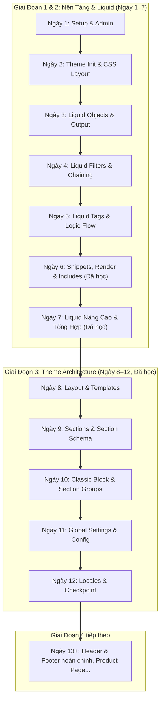

# 📓 Shopify Liquid Development — Tổng Hợp Kiến Thức Theo Lộ Trình

Tài liệu tổng hợp toàn bộ lý thuyết, cú pháp, quy tắc kiến trúc và bài tập thực hành theo lộ trình phát triển Shopify Theme.

---

## 📌 MỤC LỤC TÌM KIẾM NHANH (QUICK SEARCH MENU INDEX)

> 💡 **Mẹo:** Bạn chỉ cần **copy tên tiêu đề / từ khóa** ở cột 3 rồi bấm `Cmd + F` (hoặc `Ctrl + F`) để nhảy trực tiếp tới đúng phần kiến thức đó!

| STT | Danh Mục Kiến Thức | Từ Khóa / Tiêu Đề Copy Tìm Kiếm (Cmd + F) | Trực Tiếp Link |
| :--- | :--- | :--- | :--- |
| 1 | **Setup & Shopify CLI** | `🛠️ Ngày 1 — Setup Môi Trường & Shopify Admin` | [Xem Bài](#️-ngày-1--setup-môi-trường--shopify-admin) |
| 2 | **Cấu trúc Theme & CSS** | `🏗️ Ngày 2 — Tạo Theme Đầu Tiên & Quy Tắc CSS Layout` | [Xem Bài](#️-ngày-2--tạo-theme-đầu-tiên--quy-tắc-css-layout) |
| 3 | **Objects & Output** | `📦 Ngày 3 — Liquid Objects & Output {{ }}` | [Xem Bài](#-ngày-3--liquid-objects--output--) |
| 4 | **Filters & Chaining** | `🧪 Ngày 4 — Liquid Filters & Filter Chaining |` | [Xem Bài](#-ngày-4--liquid-filters--filter-chaining-) |
| 5 | **Logic: if / elsif / else / unless / case** | `1. Control Flow Tags (Cấu Trúc Điều Kiện & Rẽ Nhánh)` | [Xem Bài](#1-control-flow-tags-cấu-trúc-điều-kiện--rẽ-nhánh) |
| 6 | **Iteration: for / forloop / limit / offset** | `2. Iteration Tags (Vòng Lặp & Đối Tượng forloop)` | [Xem Bài](#2-iteration-tags-vòng-lặp--đối-tượng-forloop) |
| 7 | **Variable: assign / capture / increment** | `3. Variable Tags (Quản Lý Biến & Mock Data)` | [Xem Bài](#3-variable-tags-quản-lý-biến--mock-data) |
| 8 | **Phân Trang: paginate by N** | `4. Pagination Tag (Phân Trang Tự Động)` | [Xem Bài](#4-pagination-tag-phân-trang-tự-động) |
| 9 | **Built-in: Link Object (link.links, active)** | `1. Đối Tượng link (Navigation / Menu)` | [Xem Bài](#1-đối-tượng-link-navigation--menu) |
| 10 | **Built-in: Product Object (price, compare)** | `2. Đối Tượng product (Trang & Thẻ Sản Phẩm)` | [Xem Bài](#2-đối-tượng-product-trang--thẻ-sản-phẩm) |
| 11 | **Built-in: Cart Object (item_count, items)** | `3. Đối Tượng cart (Giỏ Hàng)` | [Xem Bài](#3-đối-tượng-cart-giỏ-hàng) |
| 12 | **Built-in: Shop Object (name, currency)** | `4. Đối Tượng shop (Thông Tin Cửa Hàng)` | [Xem Bài](#4-đối-tượng-shop-thông-tin-cửa-hàng) |
| 13 | **Built-in: Request Object (page_type, path)** | `5. Đối Tượng request (Thông Tin Yêu Cầu Trang)` | [Xem Bài](#5-đối-tượng-request-thông-tin-yêu-cầu-trang) |
| 14 | **Snippet & Render OS 2.0** | `🧩 Ngày 6 — Snippets, Thẻ render & Cấu Trúc Component Tái Sử Dụng` | [Xem Bài](#-ngày-6--snippets-thẻ-render--cấu-trúc-component-tái-sử-dụng) |
| 15 | **Whitespace, Metafields & Content-For** | `🚀 Ngày 7 — Liquid Nâng Cao & Mini-Project Collection Page` | [Xem Bài](#-ngày-7--liquid-nâng-cao--mini-project-collection-page) |
| 16 | **Layout, Template & Limits** | `🏛️ Ngày 8 — Layout & Templates (Theme Architecture)` | [Xem Bài](#️-ngày-8--layout--templates-theme-architecture) |
| 17 | **Section Schema: settings/blocks/presets** | `🧱 Ngày 9 — Sections Cơ Bản & Section Schema` | [Xem Bài](#-ngày-9--sections-cơ-bản--section-schema) |
| 18 | **Section Groups & Classic Block (limit/case)** | `🧩 Ngày 10 — Sections Nâng Cao: Blocks & Section Groups` | [Xem Bài](#-ngày-10--sections-nâng-cao-blocks--section-groups) |
| 19 | **Global Settings: settings_schema.json, font_picker** | `⚙️ Ngày 11 — Global Settings, Config & Theme Editor` | [Xem Bài](#️-ngày-11--global-settings-config--theme-editor) |
| 20 | **Locales: \| t, t:, publish ngôn ngữ** | `🌐 Ngày 12 — Locales, Ôn tập & Best Practices` | [Xem Bài](#-ngày-12--locales-ôn-tập--best-practices) |
| 21 | **Bảng Tra Cứu Cheat-Sheet** | `📝 BẢNG TRA CỨU NHANH CÚ PHÁP LIQUID (CHEAT-SHEET)` | [Xem Bài](#-bảng-tra-cứu-nhanh-cú-pháp-liquid-cheat-sheet) |

---

## 🗺️ Sơ Đồ Tiến Độ Học Tập



---

## 📚 TỔNG HỢP KIẾN THỨC CÁC NGÀY ĐÃ HOÀN THÀNH

### 🛠️ Ngày 1 — Setup Môi Trường & Shopify Admin
- **Dev Store:** Đăng ký tài khoản Partner & tạo Development Store với tùy chọn *Start with test data*.
- **Công cụ phát triển:**
  - Cài đặt `Node.js` & Shopify CLI (`npm install -g @shopify/cli @shopify/theme`).
  - Cài đặt VS Code Extensions: *Shopify Liquid*, *Prettier*, *GitLens*.
  - Kiểm tra lệnh CLI: `shopify version`.

---

### 🏗️ Ngày 2 — Tạo Theme Đầu Tiên & Quy Tắc CSS Layout
- **Khởi tạo Theme:** Chạy `shopify theme init my-first-theme` và khởi chạy local server `shopify theme dev`.
- **7 Thư mục chuẩn Shopify OS 2.0:**
  - `assets/`: CSS, JS, hình ảnh theme.
  - `config/`: Cấu hình Admin (`settings_schema.json`, `settings_data.json`).
  - `layout/`: Vỏ khung chính (`theme.liquid`).
  - `locales/`: Đa ngôn ngữ (`en.default.json`).
  - `sections/`: Khối giao diện kéo thả trong Theme Editor.
  - `snippets/`: Mã tái sử dụng (``).
  - `templates/`: Trang giao diện (`index.json`, `product.json`...).
- **Quy tắc nạp CSS trong `<head>` (Thứ tự Cascade):**
  1. `css-variables.liquid` (Inline) — Nạp biến màu & font face từ Admin (chống nhấp nháy FOUC).
  2. `critical.css` (Preload) — Khung lưới layout ban đầu (Above the Fold).
  3. `theme.css` — Style trang trí chi tiết, luôn nạp **SAU** `critical.css` để ghi đè style hệ thống.

---

### 📦 Ngày 3 — Liquid Objects & Output `{{ }}`
- **Cú pháp Output:** `{{ object.property }}`
- **Global Objects quan trọng:**
  - `{{ shop }}`: `name`, `email`, `currency`, `description`.
  - `{{ product }}`: `title`, `price` *(cents/xu)*, `vendor`, `type`, `handle`.
  - `{{ cart }}`: `item_count`, `total_price`, `items`.
  - `{{ customer }}`: `first_name`, `email` *(nil khi chưa login)*.
  - `{{ request }}`: `page_type` ('product', 'index'...).
- **Lưu ý giá tiền:** `product.price` lưu bằng số nguyên cents (`1000` = $10.00).
- **Mẹo Debug:** `{{ product | json }}` xem cấu trúc dữ liệu JSON.
- **Thực hành:** Snippet `snippets/store-info.liquid`.

---

### 🧪 Ngày 4 — Liquid Filters & Filter Chaining `|`
- **Cú pháp Chaining:** `{{ input | filter1 | filter2: arg }}`
- **5 Nhóm Filters cốt lõi:**
  1. **String:** `upcase`, `strip_html`, `truncate`, `escape`, `handleize`.
  2. **Money & Number:** `money` (đổi cents thành tiền tệ cửa hàng), `round`, `minus`, `times`, `divided_by`.
  3. **Array:** `first`, `last`, `join`, `size`.
  4. **URL & Asset:** `asset_url`, `stylesheet_tag`, `script_tag`, `image_url`.
  5. **Date:** `date: "%d/%m/%Y"`.
- **Thực hành:**
  - `snippets/product-price.liquid`: Tự động định dạng giá và tính phần trăm giảm giá `%`.
  - SEO Meta Description: Chuỗi filter làm sạch HTML và cắt 160 ký tự.

---

### ⚙️ Ngày 5 — Chi Tiết Logic Điều Khiển & Vòng Lặp (Liquid Tags)

#### 1. Control Flow Tags (Cấu Trúc Điều Kiện & Rẽ Nhánh):

##### **A. `if / elsif / else / endif`**
```liquid





  <span class="badge badge--sold-out">Hết hàng</span>

  <span class="badge badge--sale">Đang giảm giá</span>

  <span class="badge badge--normal">Đang bán</span>

```
👉 **Output hiển thị ra HTML:**
```html
<span class="badge badge--sale">Đang giảm giá</span>
```

##### **B. `unless / endunless`** (Chỉ chạy khi điều kiện là `false`):
```liquid



  <p class="text-error">Sản phẩm này tạm thời hết hàng</p>

```
👉 **Output hiển thị ra HTML:**
```html
<p class="text-error">Sản phẩm này tạm thời hết hàng</p>
```

##### **C. `case / when / else / endcase`**:
```liquid



  
    <p>Danh mục: Áo sơ mi</p>
  
    <p>Danh mục: Quần dài</p>
  
    <p>Danh mục khác</p>

```
👉 **Output hiển thị ra HTML:**
```html
<p>Danh mục: Áo sơ mi</p>
```

##### **D. Toán tử đặc biệt `contains`**:
```liquid



  <span class="badge">Hàng Mới Phủ Sóng</span>

```
👉 **Output hiển thị ra HTML:**
```html
<span class="badge">Hàng Mới Phủ Sóng</span>
```

---

#### 2. Iteration Tags (Vòng Lặp & Đối Tượng `forloop`):

##### **A. Vòng lặp `for` với `limit` và `offset`**:
```liquid
 Giải thích: Lấy mảng tên SP, bỏ qua SP thứ 1 (offset: 1), chỉ lấy 2 SP tiếp theo (limit: 2) 


  <p>SP {{ forloop.index }}: {{ title }}</p>

```
👉 **Output hiển thị ra HTML:**
```html
<p>SP 1: Áo Sơ Mi</p>
<p>SP 2: Quần Jeans</p>
```

##### **B. Sử dụng các thuộc tính của đối tượng `forloop`**:
```liquid



  <ul>
    <li class="item-{{ forloop.index }}">Màu {{ color }} (Cuối cùng)</li>
  </ul>

```
👉 **Output hiển thị ra HTML:**
```html
<ul>
  <li class="item-1">Màu Đỏ </li>
  <li class="item-2">Màu Xanh </li>
  <li class="item-3">Màu Vàng (Cuối cùng)</li>
</ul>
```

📊 **Bảng tổng hợp các thuộc tính của đối tượng `forloop`:**

| Thuộc tính | Kiểu dữ liệu | Mô tả chi tiết & Ứng dụng |
| :--- | :--- | :--- |
| **`forloop.first`** | Boolean (`true`/`false`) | Trả về `true` ở lượt lặp **đầu tiên**. *(Ứng dụng: Mở thẻ container `<ul>`, `<div class="grid">`)*. |
| **`forloop.last`** | Boolean (`true`/`false`) | Trả về `true` ở lượt lặp **cuối cùng**. *(Ứng dụng: Đóng thẻ container `</ul>`, thêm nhãn cuối)*. |
| **`forloop.index`** | Integer (Số nguyên) | Số thứ tự lượt lặp hiện tại, đếm từ **1** (1, 2, 3...). *(Ứng dụng: Tạo class `item-1`, `item-2`)*. |
| **`forloop.index0`** | Integer (Số nguyên) | Số thứ tự lượt lặp hiện tại, đếm từ **0** (0, 1, 2...). *(Tương ứng chỉ số index của mảng)*. |
| **`forloop.length`** | Integer (Số nguyên) | Tổng số phần tử mà vòng lặp `for` đang duyệt qua. |
| **`forloop.rindex`** | Integer (Số nguyên) | Số lượt lặp còn lại, đếm ngược về **1**. |
| **`forloop.rindex0`** | Integer (Số nguyên) | Số lượt lặp còn lại, đếm ngược về **0**. |
| **`forloop.parentloop`** | Object | Truy cập vào đối tượng `forloop` của vòng lặp cha (khi có vòng lặp lồng nhau). |

##### **C. Thao tác điều hướng `break` & `continue`**:
```liquid

   <!-- Bỏ qua lượt 2 -->
      <!-- Thoát vòng lặp ở lượt 4 -->
  <span>Số {{ i }}</span>

```
👉 **Output hiển thị ra HTML:**
```html
<span>Số 1</span>
<span>Số 3</span>
```

---

#### 3. Variable Tags (Quản Lý Biến & Mock Data):

##### **A. `assign` (Khai báo & Gán giá trị biến đơn)**:
Thẻ `` dùng để khởi tạo hoặc cập nhật một biến. Bản thân `assign` không tự in dữ liệu ra HTML, để hiển thị giá trị biến ta kết hợp với thẻ output `{{ }}`:
```liquid




<h3>Chào mừng bạn đến với {{ store_name }}</h3>
<p>Giá ưu đãi: {{ discount_price | money }}</p>
```
👉 **Output hiển thị ra HTML:**
```html
<h3>Chào mừng bạn đến với Nike Store</h3>
<p>Giá ưu đãi: $800.00</p>
```

##### **B. `capture` (Lưu khối HTML nhiều dòng vào biến)**:
```liquid
product-1

<div class="media-wrapper">
  {{ placeholder_name | placeholder_svg_tag: 'placeholder-svg' }}
</div>
```
👉 **Output hiển thị ra HTML:**
```html
<div class="media-wrapper">
  <svg class="placeholder-svg" xmlns="http://www.w3.org/2000/svg" viewbox="0 0 525 525">...</svg>
</div>
```

##### **C. `increment` (Tự động tăng biến đếm số nguyên từ 0)**:
```liquid
<p>Lần 1: </p>
<p>Lần 2: </p>
<p>Lần 3: </p>
```
👉 **Output hiển thị ra HTML:**
```html
<p>Lần 1: 0</p>
<p>Lần 2: 1</p>
<p>Lần 3: 2</p>
```

---

#### 4. Pagination Tag (Phân Trang Tự Động):
```liquid

   ... 
  {{ paginate | default_pagination }}

```
👉 **Output hiển thị ra HTML:**
```html
<div class="pagination">
  <span class="page current">1</span>
  <span class="page"><a href="/collections/all?page=2">2</a></span>
  <span class="next"><a href="/collections/all?page=2">Next »</a></span>
</div>
```

📊 **Bảng tổng hợp các thuộc tính của đối tượng `paginate`:**

| Thuộc tính | Kiểu dữ liệu | Mô tả chi tiết & Ứng dụng |
| :--- | :--- | :--- |
| **`paginate.current_page`** | Integer | Trang hiện tại người dùng đang xem (ví dụ: `1`). |
| **`paginate.pages`** | Integer | Tổng số trang được tự động chia ra. |
| **`paginate.items`** | Integer | Tổng số lượng phần tử/sản phẩm đang được phân trang. |
| **`paginate.page_size`** | Integer | Số phần tử tối đa hiển thị trên 1 trang (được cấu hình bởi `by N`, tối đa `50`). |
| **`paginate.current_offset`** | Integer | Số phần tử bị bỏ qua trước trang hiện tại (Công thức: `(current_page - 1) * page_size`). |
| **`paginate.previous`** | Object / `nil` | Đối tượng chứa thông tin trang trước (`previous.url`, `previous.title`). Trả về `nil` nếu ở Trang 1. |
| **`paginate.next`** | Object / `nil` | Đối tượng chứa thông tin trang kế tiếp (`next.url`, `next.title`). Trả về `nil` nếu ở Trang cuối. |
| **`paginate.parts`** | Array | Mảng chứa thông tin từng nút trang trong thanh phân trang (dùng để làm Custom Pagination GUI). |

#### 🛠️ Bài Tập Đã Thực Hiện (Ngày 5):
- `snippets/product-list-sample.liquid`: Render lưới sản phẩm kèm Badges (**Sale**, **Hết hàng**, **Mới**), xử lý logic `for` lặp `collections.all.products` kết hợp fallback Mock Data bằng `placeholder_svg_tag` khi store chưa có sản phẩm.

---

### 🧩 Ngày 6 — Snippets, Thẻ `render` & Cấu Trúc Component Tái Sử Dụng

#### 1. Khái niệm Snippet:
Snippet là các file mã partial nằm trong thư mục `snippets/` (đuôi `.liquid`), đại diện cho các component giao diện tái sử dụng (như Thẻ sản phẩm, Badge, Giá tiền, Menu dropdown...).

#### 2. Phân biệt `` vs ``:
* **`` (Chuẩn OS 2.0 - Khuyên dùng):** Chạy trong **Isolated Scope (Phạm vi cô lập)**. Không tự động kế thừa các biến local từ file cha (trừ các biến Global như `shop`, `cart`, `request`), giúp tránh đụng độ tên biến ngoài ý muốn và tăng tốc độ tải trang gấp nhiều lần nhờ cơ chế caching.
* **`` (Deprecated - Đã lỗi thời):** Tự động kế thừa toàn bộ biến từ file cha (Parent Scope), dễ làm xung đột tên biến và giảm hiệu năng.

#### 3. Bảng Tổng Hợp Các Dạng Cú Pháp Thẻ ``:

| Dạng Cú Pháp | Cú Pháp Code Minh Họa | Bản Chất & Cơ Chế Kỹ Thuật | Trường Hợp Sử Dụng |
| :--- | :--- | :--- | :--- |
| **1. Cơ Bản** | `` | Không truyền tham số. Snippet chỉ đọc mã HTML/CSS tĩnh hoặc biến Global (`shop`, `settings`). | Dùng cho icon SVG, thông tin cửa hàng cố định. |
| **2. Truyền Tham Số** | `` | Tạo ra các biến mới trong snippet (`product`, `price_color`). Nhận giá trị nguyên thủy (String, Boolean) hoặc nhận tham chiếu Object từ file cha sang. | Truyền dữ liệu linh hoạt, truyền nhiều biến cùng lúc. |
| **3. Truyền With / As** | `` | Cách viết tắt của `product: featured_product`. Truyền 1 Object duy nhất từ file cha vào biến `product` trong snippet. | Khi chỉ cần truyền duy nhất 1 Object vào snippet cho gọn code. |
| **4. Lặp For / As** | `` | Tự động lặp qua mảng `collection.products`. Mỗi lượt lặp render lại snippet 1 lần và gán phần tử vào biến `product` (Tự động có đối tượng `forloop`). | Render danh sách sản phẩm / bài viết (Tối ưu hiệu năng cao nhất). |
| **5. Nâng Cao: Kết Hợp Lặp For/As & Truyền Tham Số** | `` | Vừa tự động lặp mảng sản phẩm, vừa truyền thêm các cờ bật/tắt (boolean/config) vào từng lượt render snippet. | Render danh sách sản phẩm thực tế linh hoạt theo Theme Settings. |

##### 🔍 Bóc Tách Chi Tiết Cú Pháp Nâng Cao (Dạng 5):
```liquid

```
* **`render 'product-card'`**: Nhúng file component `snippets/product-card.liquid`.
* **`for collections.all.products as product`**: Vừa chạy vòng lặp qua mảng `collections.all.products`, vừa gán phần tử ở từng lượt lặp vào biến `product` (đồng thời cung cấp đối tượng `forloop`).
* **`show_vendor: true`**: Truyền cờ `show_vendor = true` cho phép snippet hiển thị thương hiệu/nhà sản xuất.
* **`show_quick_add: true`**: Truyền cờ `show_quick_add = true` cho phép snippet render nút "Thêm Nhanh" (Quick Add).
* **`lazy_load: true`**: Truyền cờ `lazy_load = true` cho phép snippet gắn `loading="lazy"` tối ưu tốc độ tải ảnh.

#### 4. Chuẩn Ghi Chú LiquidDoc (``):
Mọi snippet chuẩn OS 2.0 nên khai báo khối ghi chú ở đầu file để mô tả các `@param` đầu vào:
```liquid

  @file snippets/product-card.liquid
  @description Component hiển thị thẻ sản phẩm chuẩn OS 2.0
  @param {Object} product - Đối tượng sản phẩm cần render (Bắt buộc)
  @param {Boolean} [show_vendor=false] - Hiển thị tên nhà sản xuất hay không
  @param {Boolean} [show_quick_add=false] - Hiển thị nút Thêm nhanh hay không
  @param {Boolean} [lazy_load=true] - Kích hoạt lazy loading cho ảnh

```

#### 🛠️ Bài Tập Đã Thực Hiện (Ngày 6):
- `snippets/product-card.liquid`: Xây dựng component Thẻ sản phẩm chuẩn OS 2.0 có LiquidDoc, tính toán aspect ratio ảnh, responsive `srcset`, hiển thị giá `price_varies` / `compare_at_price`, vendor và nút Quick Add.
- Nhúng component vào `layout/theme.liquid` bằng cú pháp ``.

---

### 🚀 Ngày 7 — Liquid Nâng Cao & Mini-Project Collection Page

#### 1. Whitespace Control `` / `{{- -}}`

Liquid mặc định **giữ nguyên** mọi khoảng trắng/xuống dòng quanh thẻ ``. Với `for`/`if` lồng nhau nhiều lớp, HTML output sẽ bị thừa rất nhiều dòng trắng (không lỗi, nhưng "bẩn").

| Cú pháp | Ý nghĩa |
| :--- | :--- |
| `` | Xóa khoảng trắng **phía trước** thẻ |
| `` | Xóa khoảng trắng **phía sau** thẻ |
| `` | Xóa cả hai phía |
| `{{- output -}}` | Áp dụng tương tự cho output tag `{{ }}` |

```liquid

  <li>{{ i }}</li>

```

> 💡 Quy tắc thực dụng: dùng `-` cho tag **logic thuần** (`assign`, `if`, `for`, `liquid`, `paginate`...) vì chúng không xuất HTML. Tag **output** (`{{ product.title }}`) thường giữ nguyên để tránh dính chữ liền nhau.

#### 2. Metafields — `object.metafields`

Metafields là **dữ liệu tùy chỉnh** gắn thêm vào các object (`product`, `collection`, `shop`, `variant`...) mà theme mặc định không có field sẵn.

```liquid
{{ product.metafields.<namespace>.<key> }}
```

- `namespace`: nhóm chứa metafield (vd: `custom`, hoặc namespace riêng của app).
- `key`: tên field cụ thể.

Metafield trả về là **Object có type riêng**, phải truy cập qua `.value`, và luôn kiểm tra tồn tại trước khi dùng (rất hay `nil` nếu admin chưa nhập liệu):

```liquid


  <p>Chất liệu: {{ material.value }}</p>

```

| Type Metafield | Cách dùng |
| :--- | :--- |
| `single_line_text_field` | `{{ mf.value }}` — string trực tiếp |
| `number_integer` / `number_decimal` | `{{ mf.value }}` — dùng được với filter số |
| `boolean` | `` |
| `list.single_line_text_field` | `` (là array) |
| `file_reference` / `product_reference` | `{{ mf.value.title }}`, `{{ mf.value \| image_url }}` |
| `rich_text` | `{{ mf.value }}` (đã render sẵn HTML) |
| `json` | `{{ mf.value.some_key }}` — object JSON |

#### 3. `content_for_header` & `content_for_layout` (trong `layout/theme.liquid`)

2 thẻ **hệ thống bắt buộc**, không tự viết logic, chỉ đặt đúng vị trí trong layout:

```liquid
<head>
  ...
  {{ content_for_header }}
</head>
<body>
  {{ content_for_layout }}
</body>
```

| Thẻ | Vai trò |
| :--- | :--- |
| `content_for_header` | Shopify tự bơm script Analytics, Pixel, app scripts, meta checkout... **Bắt buộc trong `<head>`**, thiếu sẽ làm hỏng nhiều app/tracking. |
| `content_for_layout` | Nơi nội dung **template hiện tại** (section được chỉ định trong file `.json` của template) được "bơm" vào layout. Thiếu thẻ này → trang luôn trống rỗng. |

→ Đây là cơ chế cốt lõi của kiến trúc **Layout (khung cố định) → Template (định tuyến JSON) → Section (nội dung thật)**.

#### 4. Mini-Project: Trang Collection chuẩn OS 2.0

Vì `templates/collection.json` là **JSON Template**, nội dung thực sự nằm ở section được khai báo trong đó (`"type": "collection"` → trỏ tới `sections/collection.liquid`). Đã nâng cấp trực tiếp file này thay vì tạo `templates/collection.liquid` kiểu Vintage (file đó sẽ không được Shopify route tới nếu JSON template cùng tên đã tồn tại).

```liquid

  <p>Hiển thị {{ collection.products.size }} / {{ collection.products_count }} sản phẩm</p>

  <div class="collection-page__grid">
    
  </div>

  
    <div class="collection-page__pagination">
      {{ paginate | default_pagination }}
    </div>
  

```

Điểm mới so với bản Vintage ban đầu:
- Grid responsive 4 → 2 → 1 cột qua `@media` trong khối `` (co giãn theo màn hình thay vì cố định `repeat(4, 1fr)`).
- Số sản phẩm/trang và toggle hiển thị vendor được đưa vào `` (`products_per_page`, `show_vendor`) — cho phép merchant chỉnh trong Theme Editor thay vì hard-code.
- Tái sử dụng lại `product-card` component đã xây ở Ngày 6 qua cú pháp `render 'for as'`.

#### 🛠️ Bài Tập Đã Thực Hiện (Ngày 7):
- `sections/collection.liquid`: Nâng cấp thành mini-project Collection Page — whitespace control, `paginate by section.settings.products_per_page`, grid responsive, tái sử dụng `product-card`, `default_pagination`.
- Xác nhận `shopify theme check --path my-first-theme` chạy sạch (43 files, không lỗi).

---

### 🏛️ Ngày 8 — Layout & Templates (Theme Architecture)

#### 1. `layout/theme.liquid` — Khung xương của mọi trang

```
layout/theme.liquid
  └── <head>: SEO, {{ content_for_header }}  ← BẮT BUỘC
  └── <body>
       ├── 
       ├── <main>{{ content_for_layout }}</main>  ← "khoét lỗ" cho nội dung template
       └── 
```

Layout không cố định 1 file — template có thể **override** layout mặc định qua field `"layout"` trong JSON template:
```json
// templates/password.json
{ "layout": "password", "sections": {...}, "order": [...] }
```
→ Route password dùng `layout/password.liquid` (không header/footer) thay vì `layout/theme.liquid` mặc định — dùng cho các trang cần khung tối giản (password, checkout embed...).

#### 2. Templates — quyết định nội dung theo route

| Kiểu | Ví dụ | Đặc điểm |
| :--- | :--- | :--- |
| `.json` (chuẩn OS 2.0) | `index.json`, `product.json`, `collection.json` | Merchant kéo-thả section trong Theme Editor, không cần code |
| `.liquid` (kiểu cũ) | `gift_card.liquid` | Code viết cứng, merchant không customize được |

**Custom page template**: tạo `templates/page.<tên>.json` (VD `page.about.json`) → Admin → Pages sẽ có thêm lựa chọn template "about" cho merchant chọn.

#### 3. Bảng Limits cần nhớ

| Giới hạn | Giá trị | Ý nghĩa thực tế |
| :--- | :--- | :--- |
| Sections / template | 25 | Không nhồi quá nhiều section/trang |
| Blocks / section | 50 | |
| Nested blocks depth | 8 | Block lồng block tối đa 8 tầng |
| `for` loop iterations | 50 | Vượt quá bắt buộc dùng `paginate` |
| File size / section-snippet | 100KB | |
| Tổng số file theme | 1,000 | |

> 💡 Giới hạn "50 iterations" chính là lý do bắt buộc dùng `paginate` khi render `collection.products` — không chỉ vì UX, Liquid sẽ cắt ngang nếu `for` quá 50 phần tử.

#### 🛠️ Ghi chú (Ngày 8):
Ngày này thiên về đọc hiểu kiến trúc, roadmap không có mini-project riêng.

---

### 🧱 Ngày 9 — Sections Cơ Bản & Section Schema

#### 1. Anatomy 1 file Section

```
sections/my-section.liquid
├── HTML markup       → dùng {{ section.settings.xxx }}
├──        → name, tag, class, settings[], blocks[], max_blocks, presets[]
├──    → CSS riêng (Shopify tự dedupe, dù section lặp nhiều lần/trang chỉ load 1 lần)
└──    → JS riêng (optional)
```

`name`/`tag`/`class` — 3 vai trò độc lập, KHÔNG phải để "nhận diện":

| Field | Vai trò thật |
| :--- | :--- |
| `name` | Tên hiển thị trong danh sách "Add section" (UI merchant) |
| `tag` | Thẻ HTML Shopify tự bọc quanh output (`section`/`div`/`article`) |
| `class` | CSS class thêm vào đúng thẻ bọc đó |

#### 2. `settings[]` — bảng type đầy đủ

| Type | Field đặc thù | Giá trị trả về |
| :--- | :--- | :--- |
| `text`, `textarea` | — | string |
| `richtext` | — | string **có sẵn HTML** |
| `select`, `radio` | `options: [{value,label}]` | value đã chọn |
| `checkbox` | — | `true`/`false` |
| `range` | `min`, `max`, `step`, `unit` | number |
| `color` | — | string mã màu |
| `image_picker` | — | **image object** (cần `\| image_url`) |
| `product`/`collection`/`page` | — | **object** đầy đủ |
| `text_alignment` | tự có left/center/right | string |
| `header`, `paragraph` | — | **không có `id`**, không lưu giá trị, chỉ hiển thị UI |

> ⚠️ Mỗi phần tử trong `settings[]` gọi là **"setting field"**, KHÔNG gọi là "block" — tránh nhầm với khái niệm Block (mục 3).

#### 2b. 2 file locale khác nhau — dễ nhầm

| File | Dùng cho | Gọi bằng |
| :--- | :--- | :--- |
| `locales/en.default.json` | Text khách hàng thấy ngoài storefront | filter `\| t` trong HTML, VD `{{ 'password.enter' \| t }}` |
| `locales/en.default.schema.json` | Text merchant thấy **trong Theme Editor** (label, tên section) | tiền tố `t:` **trong ``**, VD `"name": "t:general.group"` |

#### 3. `blocks[]` — Classic block vs Theme block (`@theme`)

| | Classic block | Theme block (`@theme`) |
| :--- | :--- | :--- |
| Khai báo | `"blocks": [{"type":"text_block","settings":[...]}]` ngay trong schema section | File riêng trong thư mục `blocks/`, section chỉ ghi `"blocks":[{"type":"@theme"}]` |
| Tái dùng chéo section khác | ❌ Không | ✅ Có |
| Render | `...` | `` |
| Lồng block trong block | Không hỗ trợ | ✅ Có (VD Group chứa Text, tối đa 8 tầng) |

Ví dụ thật trong project: [sections/custom-section.liquid](../my-first-theme/sections/custom-section.liquid) dùng `@theme`, cho phép nhúng [blocks/group.liquid](../my-first-theme/blocks/group.liquid) và [blocks/text.liquid](../my-first-theme/blocks/text.liquid). Dữ liệu block instance (id, settings, `block_order`) được lưu trong file JSON template (VD `templates/index.json`), không nằm trong file `.liquid`.

#### 4. `presets[]` — ⚠️ dễ hiểu sai nhất

`preset.settings` **KHÔNG PHẢI** nơi viết CSS tự do. Nó chỉ set giá trị mặc định cho **đúng những `id` đã tồn tại trong `settings[]`** — không thể thêm key tuỳ ý hay property CSS:
```json
"presets": [
  { "name": "Feature Banner — Sale", "settings": { "height": "large" } }
  // "height" PHẢI đã khai báo id ở settings[] phía trên, không phải CSS
]
```
`preset.name` = tên hiện trong khay "Add section" (catalog chọn), không phải text hiển thị thật trên trang.

#### 5. Block Instance trong file JSON Template — cú pháp đầy đủ & cách hoạt động

Có 2 việc hoàn toàn khác nhau, dễ lẫn lộn:

| | Khai báo Ở ĐÂU | Vai trò |
| :--- | :--- | :--- |
| **Schema `blocks[]`** (mục 3) | Trong file `.liquid` | Định nghĩa **LUẬT**: loại block nào ĐƯỢC PHÉP thêm |
| **Block instance** (mục này) | Trong file `.json` (template) | Lưu **THỰC THỂ CỤ THỂ** đã thêm — id nào, settings gì, thứ tự nào |

**Cú pháp đầy đủ 1 block instance** — chỉ đúng 5 field built-in này, thêm key lạ sẽ bị Shopify âm thầm bỏ qua:

```json
"block_key_tuỳ_đặt": {
  "type": "text",
  "settings": { "id_setting": "giá_trị" },
  "blocks": { "block_key_con": { ... } },
  "block_order": ["block_key_con"],
  "disabled": false
}
```

| Field | Bắt buộc? | Ý nghĩa |
| :--- | :--- | :--- |
| `type` | ✅ | Khớp tên block đã khai (classic type trong schema, hoặc tên file trong `blocks/` nếu section cha dùng `@theme`) |
| `settings` | Tuỳ chọn | Key phải trùng đúng `id` đã khai trong `settings[]` của schema block đó; thiếu field nào tự lấy `default` |
| `blocks` | Tuỳ chọn | Chỉ có tác dụng nếu **chính block này** cũng khai `"blocks":[{"type":"@theme"}]` trong schema của nó (VD `group.liquid`) — chứa block CON lồng bên trong |
| `block_order` | Bắt buộc nếu có `blocks` | Thứ tự hiển thị các key trong `blocks` — vì JSON object `{}` không đảm bảo giữ thứ tự như array `[]`, nên cần mảng riêng để chỉ rõ thứ tự |
| `disabled` | Tuỳ chọn | `true` = ẩn block khi render, giữ nguyên config (khác xoá hẳn) |

> ⚠️ `"group_1"`, `"text_1"`... chỉ là **key bạn tự đặt** để làm ID nhận diện (miễn không trùng key khác cùng cấp) — **không phải** giá trị của 1 field tên `"name"`. Đừng nhầm với `"name"` trong `` (đó là field khác, hiện tên trong Theme Editor).

**Ví dụ trace 3 tầng lồng nhau — đúng cấu trúc thật trong project:**
```json
"feature_banner_1": {
  "type": "custom-section",
  "settings": { "background_image": "banner.jpg" },
  "blocks": {
    "group_1": {
      "type": "group",
      "settings": { "layout_direction": "group--horizontal", "padding": 20 },
      "blocks": {
        "text_1": { "type": "text", "settings": { "text": "Sale 50%", "text_style": "text--title" } },
        "text_2": { "type": "text", "settings": { "text": "Chỉ hôm nay", "text_style": "text--subtitle" } }
      },
      "block_order": ["text_1", "text_2"]
    }
  },
  "block_order": ["group_1"]
}
```
→ HTML render ra: `<div class="custom-section">` → `<div class="group group--horizontal">` → 2 `<div class="text ...">` lồng bên trong, đúng thứ tự `block_order`.

#### ⚠️ 3 hiểu lầm phổ biến cần tránh (đã sửa qua thực hành)

1. **"Viết `feature_banner_1` vào JSON = đổi router tới `feature-banner.liquid`"** — SAI. Route (URL nào dùng template nào) không hề đổi. `index.json` **đã cố định** cho route `/` từ trước; thêm object mới chỉ là **thêm 1 khối nội dung mới** vào trang đã tồn tại sẵn, `"type"` chỉ chọn dùng file `.liquid` nào để vẽ khối đó — không liên quan gì tới định tuyến URL.
2. **"Thêm block = chèn code HTML+schema vào bên trong file section"** — SAI. Code của block (`blocks/group.liquid`, `blocks/text.liquid`) **đã tồn tại sẵn** ở file riêng, không hề bị copy/chèn vào `feature-banner.liquid`. JSON chỉ tạo 1 **tham chiếu (reference)**: "tại vị trí ``, hãy chạy giùm file này rồi dán KẾT QUẢ vào đây" — file gốc không đổi 1 dòng nào.
3. **"Các object trong JSON được lấy từ schema"** — SAI. Object trong JSON là do **người viết theme tự gõ ra** (hoặc Theme Editor tự ghi khi merchant kéo-thả), **không phải** Shopify tự sinh/copy từ schema. Schema chỉ đóng vai trò **luật kiểm tra** (id/type nào hợp lệ) — JSON phải *tuân theo* luật đó, không phải *lấy từ* luật đó.

#### 🛠️ Bài Tập Đang Thực Hiện (Ngày 9):
- `sections/feature-banner.liquid`: Section áp dụng đủ `image_picker`, `text_alignment`, `header`, `@theme` blocks, `tag`/`class`, 2 `presets` — đang trong quá trình hoàn thiện.

---

### 🧩 Ngày 10 — Sections Nâng Cao: Blocks & Section Groups

#### 1. Section Groups — khác hẳn "Block", dễ nhầm vì tên gần giống

| | `` (số ít) | `` (số nhiều) |
| :--- | :--- | :--- |
| Render | Đúng 1 section | **Cả 1 NHÓM section** khai báo trong file `x-group.json` |
| Merchant tuỳ chỉnh | Không thêm/bớt được section khác | **Thêm/bớt/sắp xếp lại** nhiều section trong nhóm |
| File cấu hình | Không cần | `sections/<tên>-group.json` — cùng cấu trúc `sections{}`+`order[]` như template |

Ví dụ thật trong project — [layout/theme.liquid](../my-first-theme/layout/theme.liquid):
```liquid

...
{{ content_for_layout }}
...

```
[sections/header-group.json](../my-first-theme/sections/header-group.json):
```json
{
  "type": "header",
  "sections": { "header": { "type": "header", "settings": {} } },
  "order": ["header"]
}
```
→ Dùng Section Group cho header/footer để merchant có thể **tự thêm section khác vào giữa** (VD 1 thanh khuyến mãi phía trên header) mà không cần dev sửa code — vì file `*-group.json` cũng có `order[]` y hệt template.

#### 2. Classic Block nâng cao — `limit` + nhiều `type` trong 1 section

**Quan trọng nhất cần nhớ**: Classic block **KHÔNG có file riêng** như Theme block (`@theme`, Ngày 9) — toàn bộ settings khai báo **ngay bên trong `schema.blocks[]` của chính section đó**:

```json
"blocks": [
  {
    "type": "icon_with_text",
    "name": "Icon with text",
    "limit": 4,
    "settings": [
      { "type": "select", "id": "icon", "label": "Icon", "options": [...] },
      { "type": "text", "id": "heading", "label": "Heading" }
    ]
  }
]
```
- `limit: 4` → merchant tối đa thêm 4 block loại này (giới hạn riêng từng `type`, độc lập nhau).
- Classic block **chỉ tồn tại và dùng được trong đúng 1 file section đã khai nó** — muốn dùng lại ở section khác phải **copy y nguyên khai báo** sang, sửa 1 bên không tự đồng bộ bên kia (khác hẳn `@theme` dùng chung 1 file cho mọi section).

**Render bằng `case`/`when` — cú pháp chuẩn (hay viết sai):**
```liquid

  <div {{ block.shopify_attributes }}>
    
      
        <h3>{{ block.settings.heading }}</h3>
      
        
    
  </div>

```
> ⚠️ Lỗi hay gặp: viết `` — SAI. `case` phải đặt **tên biến** (`block.type`), còn `'icon_with_text'` chỉ xuất hiện trong `when` để so sánh giá trị.

`{{ block.shopify_attributes }}` — **luôn phải có** trên thẻ HTML gốc của mỗi block, để Theme Editor highlight đúng block khi merchant hover/click.

#### 3. `presets.blocks` — tạo sẵn NỘI DUNG mặc định, không phải "hiển thị mặc định"

```json
"presets": [{
  "name": "Feature Columns",
  "blocks": [
    { "type": "icon_with_text", "settings": { "icon": "truck", "heading": "Free Shipping" }},
    { "type": "icon_with_text", "settings": { "icon": "lock", "heading": "Secure Payment" }}
  ]
}]
```
→ Khi merchant lần đầu thêm section này, Shopify **tự động tạo sẵn các block instance thật** (có data cụ thể) — không phải chỉnh CSS/style hiển thị. Không có `presets.blocks` → section thêm vào sẽ **trống trơn**, merchant phải tự bấm "Add block" từng cái.

#### 🛠️ Bài Tập Đã Thực Hiện (Ngày 10):
- `sections/trust-badge.liquid`: Section dùng classic block `icon_with_text` (`limit: 3`), render bằng `for` + `case block.type` + `block.shopify_attributes`, `presets.blocks` tạo sẵn 2 block mặc định.

---

### ⚙️ Ngày 11 — Global Settings, Config & Theme Editor

#### 1. `config/settings_schema.json` — cấu trúc MẢNG lồng NHÓM, khác Section Schema

```json
[
  { "name": "theme_info", "theme_name": "...", ... },   ← phần tử ĐẶC BIỆT đầu tiên, không có "settings"
  { "name": "Typography", "settings": [ ... ] },         ← 1 NHÓM = 1 tab trong Theme Settings panel
  { "name": "Colors", "settings": [ ... ] }
]
```

| So với Section Schema | `settings_schema.json` |
| :--- | :--- |
| `settings[]` là 1 mảng phẳng duy nhất | `settings[]` nằm lồng bên trong từng object nhóm, các nhóm nằm trong 1 mảng ngoài cùng |
| `name` = tên hiện "Add section" | `name` (ở object nhóm) = **tên tab** trong Theme Settings |
| Không có `theme_info` | Phần tử đầu tiên **luôn phải là `theme_info`** (metadata theme, không có `settings`) |

#### 2. `font_picker` — trả về Font Object, không phải string

```liquid
{{ settings.type_primary_font.family }}              → "Work Sans"
{{ settings.type_primary_font.fallback_families }}    → "sans-serif"
{{ settings.type_primary_font.style }}                → "normal"/"italic"
{{ settings.type_primary_font.weight }}                → 400/700
```
**`font_face` filter** — bắt buộc gọi thì trình duyệt mới thực sự tải file font (lấy `.family` chỉ ra tên, không phải file):
```liquid
{{ settings.type_primary_font | font_face: font_display: 'swap' }}
{{ settings.type_primary_font | font_modify: 'weight', 'bold' | font_face: font_display: 'swap' }}
```
→ Gọi nhiều lần với `font_modify` để tải đủ biến thể bold/italic, tránh trình duyệt tự giả lập (faux bold/italic bị vỡ nét).

#### 3. `` khác ``

| | `` (Ngày 9) | `` |
| :--- | :--- | :--- |
| Dùng ở đâu | Chỉ trong `sections/`, `blocks/` | Dùng được ở **bất kỳ đâu** (snippet, layout...) |
| Chạy Liquid động? | Không | **Có** — dùng được `{{ settings.xxx }}` |

Ví dụ thật — [snippets/css-variables.liquid](../my-first-theme/snippets/css-variables.liquid) dùng `` để sinh CSS variable từ `settings.xxx` toàn cục, load đầu tiên trong `<head>` theo đúng rule CSS đã học Ngày 2.

#### 4. `settings.xxx` (global) vs `section.settings.xxx` (scoped)
- `settings.xxx` → đọc từ `config/settings_schema.json`, áp dụng **toàn site**.
- `section.settings.xxx` → đọc từ `` của **1 section instance cụ thể**, chỉ đổi theo section đó.

#### 🛠️ Bài Tập Đã Thực Hiện (Ngày 11):
- Thêm nhóm "Buttons" (`button_bg_color`, `button_text_color`, `button_corner_radius`) vào `config/settings_schema.json`.
- Sinh CSS variable tương ứng trong `snippets/css-variables.liquid`.
- Áp dụng `var(--color-button-bg)`, `var(--color-button-text)`, `var(--button-corner-radius)` vào nút Quick Add trong `snippets/product-card.liquid`.
- ⚠️ Lỗi thực tế đã gặp: gõ nhầm `id` (`buttno_corner_radius` thay vì `button_corner_radius`) giữa 2 file → biến CSS rỗng, không lỗi rõ ràng (Liquid không báo lỗi khi gọi property không tồn tại, chỉ trả về rỗng) — bài học: luôn đối chiếu `id` khớp tuyệt đối giữa nơi khai báo và nơi sử dụng.

---

### 🌐 Ngày 12 — Locales, Ôn tập & Best Practices

#### 1. Mỗi ngôn ngữ = 2 file riêng biệt, vai trò khác hẳn nhau

| File | Ai thấy | "Dây nối" trong code |
| :--- | :--- | :--- |
| `<mã>.json` (VD `vi.json`) | **Khách hàng** ngoài storefront | `{{ 'key.path' \| t }}` |
| `<mã>.schema.json` (VD `vi.schema.json`) | **Merchant** trong Theme Editor | `"t:key.path"` bên trong `` |

**Cú pháp key trong JSON — tên tuỳ đặt, không cố định:**
```json
{ "cart": { "checkout": "Thanh toán", "remove": "Xoá" } }
```
`checkout`/`remove` là tên tự đặt — điều bắt buộc duy nhất là **key trong JSON phải khớp CHÍNH XÁC đường dẫn gọi trong code** (`{{ 'cart.checkout' | t }}`). Thiếu `| t` hoặc `t:` → Shopify in ra **nguyên văn chuỗi key**, không tra cứu file locale nào, dù file dịch có đầy đủ tới đâu.

#### 2. Phạm vi: chỉ dịch được chữ CỐ ĐỊNH của theme, không dịch nội dung merchant tự nhập

| Loại nội dung | Dịch qua đâu |
| :--- | :--- |
| Chữ cố định do dev viết trong theme (nút, label, tiêu đề section) | ✅ `locales/*.json` + `*.schema.json` |
| Nội dung merchant tự nhập (tên sản phẩm, mô tả, tên trang) | ❌ Phải dùng app **Shopify Translate & Adapt** riêng |

#### 3. Thêm ngôn ngữ vào theme KHÔNG tự động publish lên store

Tạo file `vi.json`/`vi.schema.json` chỉ là **tạo sẵn nội dung dịch**. Muốn hiện trong Theme Editor / storefront thật:
1. Admin → **Settings → Languages** → **Add language** → chọn ngôn ngữ.
2. Ngôn ngữ mới sẽ ở trạng thái **"Not published"** — phải bấm menu `...` → **Publish** (không cần chờ dịch xong nội dung sản phẩm, chữ cố định của theme dùng ngay file locale đã có).

#### 4. Checkpoint cuối Giai đoạn 3 — bộ khung section cần có

| File yêu cầu | Trạng thái project |
| :--- | :--- |
| `header.liquid`, `footer.liquid` | ✅ Đã có |
| `hero-banner.liquid` | ⚠️ Làm tương đương ở `feature-banner.liquid` (Ngày 9) |
| `feature-columns.liquid` | ⚠️ Làm tương đương ở `trust-badge.liquid` (Ngày 10) |
| `announcement-bar.liquid`, `featured-collection.liquid`, `rich-text.liquid` | ❌ Chưa có |

> ✅ Checkpoint chính thức roadmap: "Tạo được theme với sections drag-and-drop trong Theme Editor" — đã đạt về mặt kỹ năng.

#### 🛠️ Bài Tập Đã Thực Hiện (Ngày 12):
- Tạo `locales/vi.json` + `locales/vi.schema.json` (tiếng Việt) và `locales/fr.json` + `locales/fr.schema.json` (tiếng Pháp), dịch đầy đủ tương ứng từng key với `en.default.json`/`en.default.schema.json`.
- Sửa kèm 1 bug JSON có sẵn (trailing comma) trong `en.default.schema.json`.

---

## 📚 BẢNG TỔNG HỢP CÁC THUỘC TÍNH BUILT-IN CỐT LÕI (OBJECT PROPERTIES)

### 1. Đối Tượng `link` (Navigation / Menu)
| Thuộc tính | Kiểu dữ liệu | Ý nghĩa & Mô tả |
| :--- | :--- | :--- |
| **`link.title`** | String | Tên hiển thị của menu (VD: `"Trang chủ"`, `"Sản phẩm"`). |
| **`link.url`** | String | Đường dẫn liên kết (VD: `/collections/all`). |
| **`link.links`** | Array | Mảng chứa danh sách các menu con cấp 2 (Child links). |
| **`link.active`** | Boolean | Trả về `true` nếu trang hiện tại trùng khớp với URL của link. |
| **`link.child_active`** | Boolean | Trả về `true` nếu một trong các menu con của nó đang được mở. |
| **`link.levels`** | Integer | Số cấp menu con sâu nhất bên dưới (0 = không có menu con, 1 = 2 cấp, 2 = 3 cấp). |
| **`link.type`** | String | Phân loại link (`'catalog_link'`, `'collection_link'`, `'product_link'`, `'frontpage_link'`...). |

### 2. Đối Tượng `product` (Trang & Thẻ Sản Phẩm)
| Thuộc tính | Kiểu dữ liệu | Ý nghĩa & Mô tả |
| :--- | :--- | :--- |
| **`product.title`** | String | Tên sản phẩm. |
| **`product.handle`** | String | URL slug đại diện (VD: `ao-thun-polo-nam`). |
| **`product.description`** | String / HTML | Nội dung mô tả chi tiết của sản phẩm. |
| **`product.price`** | Integer | Giá hiện tại (tính bằng đơn vị xu/cents). |
| **`product.compare_at_price`** | Integer / `nil` | Giá gốc chưa giảm (dùng so sánh tính % sale). |
| **`product.price_varies`** | Boolean | Trả về `true` nếu các biến thể có mức giá khác nhau. |
| **`product.available`** | Boolean | Trả về `true` nếu sản phẩm còn hàng. |
| **`product.featured_image`** | Image Object | Ảnh đại diện chính của sản phẩm. |
| **`product.images`** | Array | Mảng chứa toàn bộ hình ảnh của sản phẩm. |
| **`product.variants`** | Array | Mảng chứa danh sách các biến thể (màu sắc, kích thước...). |
| **`product.vendor`** | String | Nhà sản xuất / Thương hiệu. |
| **`product.type`** | String | Loại sản phẩm (VD: `"Áo Nam"`, `"Giày"`). |
| **`product.tags`** | Array | Mảng các nhãn tag của sản phẩm. |
| **`product.url`** | String | Đường dẫn tương đối tới trang sản phẩm (`/products/ao-thun`). |

### 3. Đối Tượng `cart` (Giỏ Hàng)
| Thuộc tính | Kiểu dữ liệu | Ý nghĩa & Mô tả |
| :--- | :--- | :--- |
| **`cart.item_count`** | Integer | Tổng số lượng sản phẩm đang có trong giỏ hàng. |
| **`cart.total_price`** | Integer | Tổng số tiền tạm tính của giỏ hàng (đơn vị xu/cents). |
| **`cart.items`** | Array | Mảng chứa từng sản phẩm trong giỏ hàng (Line Items). |
| **`cart.note`** | String | Ghi chú của khách hàng gửi kèm đơn hàng. |

### 4. Đối Tượng `shop` (Thông Tin Cửa Hàng)
| Thuộc tính | Kiểu dữ liệu | Ý nghĩa & Mô tả |
| :--- | :--- | :--- |
| **`shop.name`** | String | Tên của cửa hàng. |
| **`shop.email`** | String | Email liên hệ chính của cửa hàng. |
| **`shop.currency`** | String | Mã tiền tệ của cửa hàng (VD: `USD`, `VND`). |
| **`shop.description`** | String | Mô tả ngắn của cửa hàng (dùng cài đặt SEO). |
| **`shop.url`** | String | Đường dẫn trang chủ cửa hàng (`https://yourstore.com`). |

### 5. Đối Tượng `request` (Thông Tin Yêu Cầu Trang)
| Thuộc tính | Kiểu dữ liệu | Ý nghĩa & Mô tả |
| :--- | :--- | :--- |
| **`request.page_type`** | String | Loại trang hiện tại (`'index'`, `'product'`, `'collection'`, `'cart'`, `'page'`...). |
| **`request.path`** | String | Đường dẫn URL tương đối của trang hiện tại (VD: `/products/gift-card`). |
| **`request.locale`** | Locale Object | Ngôn ngữ trang hiện tại (`request.locale.iso_code` -> `'en'`, `'vi'`). |

---

## 🔮 CÁC NGÀY TIẾP THEO (SẼ CẬP NHẬT TIẾP TỤC)

- **Ngày 13 trở đi (Giai đoạn 4 — Xây dựng các trang cốt lõi):** Header & Footer hoàn chỉnh, Product Page, Collection Page, Cart Page, Search/404.

---

## 📝 BẢNG TRA CỨU NHANH CÚ PHÁP LIQUID (CHEAT-SHEET)

| Loại Cú Pháp | Ký Hiệu | Mục Đích Sử Dụng | Ví Dụ Code Minh Họa | Từ Khóa Tiêu Đề Để Tìm Kiếm (Cmd + F) |
| :--- | :--- | :--- | :--- | :--- |
| **Output** | `{{ ... }}` | In dữ liệu ra giao diện HTML | `{{ product.title }}` | `📦 Ngày 3 — Liquid Objects & Output {{ }}` |
| **Tag Logic** | `` | Thực thi logic rẽ nhánh & vòng lặp | `` | `1. Control Flow Tags (Cấu Trúc Điều Kiện & Rẽ Nhánh)` |
| **Filter** | `\|` | Biến đổi dữ liệu (chuỗi, số, mảng, ngày) | `{{ product.price \| money }}` | `🧪 Ngày 4 — Liquid Filters & Filter Chaining \|` |
| **Comment** | `` | Ghi chú nhiều dòng không in ra HTML | ` Note ` | `Cheat-Sheet` |
| **Inline Comment** | `` | Ghi chú 1 dòng gọn gàng | `` | `Cheat-Sheet` |
| **Trim Whitespace** | `` | Xóa khoảng trắng thừa trong HTML | `` | `Cheat-Sheet` |
| **Render Snippet** | `` | Nhúng snippet partial reusable | `` | `🏗️ Ngày 2 — Tạo Theme Đầu Tiên & Quy Tắc CSS Layout` |
| **Iteration** | `` | Duyệt qua danh sách mảng | `` | `2. Iteration Tags (Vòng Lặp & Đối Tượng forloop)` |
| **Variable Assign** | `` | Khai báo hoặc cập nhật biến đơn | `` | `3. Variable Tags (Quản Lý Biến & Mock Data)` |
| **Variable Capture** | `` | Lưu khối HTML nhiều dòng vào biến | ` ... ` | `3. Variable Tags (Quản Lý Biến & Mock Data)` |
| **Pagination** | `` | Phân trang tự động cho mảng lớn | `` | `4. Pagination Tag (Phân Trang Tự Động)` |
