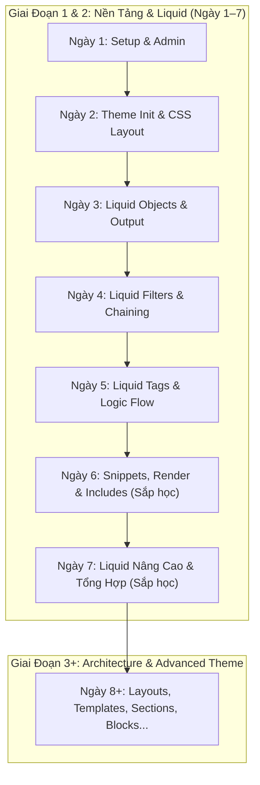

# 📓 Shopify Liquid Development — Tổng Hợp Kiến Thức Theo Lộ Trình

Tài liệu tổng hợp toàn bộ lý thuyết, cú pháp, quy tắc kiến trúc và bài tập thực hành theo lộ trình phát triển Shopify Theme.

---

## 📌 MỤC LỤC TÌM KIẾM NHANH (QUICK SEARCH MENU INDEX)

> 💡 **Mẹo:** Bạn chỉ cần **copy tên tiêu đề / từ khóa** ở cột 3 rồi bấm `Cmd + F` (hoặc `Ctrl + F`) để nhảy trực tiếp tới đúng phần kiến thức đó!

| STT | Danh Mục Kiến Thức | Từ Khóa / Tiêu Đề Copy Tìm Kiếm (Cmd + F) | Trực Tiếp Link |
| :--- | :--- | :--- | :--- |
| 1 | **Setup & Shopify CLI** | `🛠️ Ngày 1 — Setup Môi Trường & Shopify Admin` | [Xem Bài](#️-ngày-1--setup-môi-trường--shopify-admin) |
| 2 | **Cấu trúc Theme & CSS** | `🏗️ Ngày 2 — Tạo Theme Đầu Tiên & Quy Tắc CSS Layout` | [Xem Bài](#️-ngày-2--tạo-theme-đầu-tiên--quy-tắc-css-layout) |
| 3 | **Objects & Output** | `📦 Ngày 3 — Liquid Objects & Output {{ }}` | [Xem Bài](#-ngày-3--liquid-objects--output--) |
| 4 | **Filters & Chaining** | `🧪 Ngày 4 — Liquid Filters & Filter Chaining |` | [Xem Bài](#-ngày-4--liquid-filters--filter-chaining-) |
| 5 | **Logic: if / elsif / else / unless / case** | `1. Control Flow Tags (Cấu Trúc Điều Kiện & Rẽ Nhánh)` | [Xem Bài](#1-control-flow-tags-cấu-trúc-điều-kiện--rẽ-nhánh) |
| 6 | **Iteration: for / forloop / limit / offset** | `2. Iteration Tags (Vòng Lặp & Đối Tượng forloop)` | [Xem Bài](#2-iteration-tags-vòng-lặp--đối-tượng-forloop) |
| 7 | **Variable: assign / capture / increment** | `3. Variable Tags (Quản Lý Biến & Mock Data)` | [Xem Bài](#3-variable-tags-quản-lý-biến--mock-data) |
| 8 | **Phân Trang: paginate by N** | `4. Pagination Tag (Phân Trang Tự Động)` | [Xem Bài](#4-pagination-tag-phân-trang-tự-động) |
| 9 | **Built-in: Link Object (link.links, active)** | `1. Đối Tượng link (Navigation / Menu)` | [Xem Bài](#1-đối-tượng-link-navigation--menu) |
| 10 | **Built-in: Product Object (price, compare)** | `2. Đối Tượng product (Trang & Thẻ Sản Phẩm)` | [Xem Bài](#2-đối-tượng-product-trang--thẻ-sản-phẩm) |
| 11 | **Built-in: Cart Object (item_count, items)** | `3. Đối Tượng cart (Giỏ Hàng)` | [Xem Bài](#3-đối-tượng-cart-giỏ-hàng) |
| 12 | **Built-in: Shop Object (name, currency)** | `4. Đối Tượng shop (Thông Tin Cửa Hàng)` | [Xem Bài](#4-đối-tượng-shop-thông-tin-cửa-hàng) |
| 13 | **Built-in: Request Object (page_type, path)** | `5. Đối Tượng request (Thông Tin Yêu Cầu Trang)` | [Xem Bài](#5-đối-tượng-request-thông-tin-yêu-cầu-trang) |
| 14 | **Snippet & Render OS 2.0** | `🧩 Ngày 6 — Snippets, Thẻ render & Cấu Trúc Component Tái Sử Dụng` | [Xem Bài](#-ngày-6--snippets-thẻ-render--cấu-trúc-component-tái-sử-dụng) |
| 15 | **Bảng Tra Cứu Cheat-Sheet** | `📝 BẢNG TRA CỨU NHANH CÚ PHÁP LIQUID (CHEAT-SHEET)` | [Xem Bài](#-bảng-tra-cứu-nhanh-cú-pháp-liquid-cheat-sheet) |

---

## 🗺️ Sơ Đồ Tiến Độ Học Tập



---

## 📚 TỔNG HỢP KIẾN THỨC CÁC NGÀY ĐÃ HOÀN THÀNH

### 🛠️ Ngày 1 — Setup Môi Trường & Shopify Admin
- **Dev Store:** Đăng ký tài khoản Partner & tạo Development Store với tùy chọn *Start with test data*.
- **Công cụ phát triển:**
  - Cài đặt `Node.js` & Shopify CLI (`npm install -g @shopify/cli @shopify/theme`).
  - Cài đặt VS Code Extensions: *Shopify Liquid*, *Prettier*, *GitLens*.
  - Kiểm tra lệnh CLI: `shopify version`.

---

### 🏗️ Ngày 2 — Tạo Theme Đầu Tiên & Quy Tắc CSS Layout
- **Khởi tạo Theme:** Chạy `shopify theme init my-first-theme` và khởi chạy local server `shopify theme dev`.
- **7 Thư mục chuẩn Shopify OS 2.0:**
  - `assets/`: CSS, JS, hình ảnh theme.
  - `config/`: Cấu hình Admin (`settings_schema.json`, `settings_data.json`).
  - `layout/`: Vỏ khung chính (`theme.liquid`).
  - `locales/`: Đa ngôn ngữ (`en.default.json`).
  - `sections/`: Khối giao diện kéo thả trong Theme Editor.
  - `snippets/`: Mã tái sử dụng (``).
  - `templates/`: Trang giao diện (`index.json`, `product.json`...).
- **Quy tắc nạp CSS trong `<head>` (Thứ tự Cascade):**
  1. `css-variables.liquid` (Inline) — Nạp biến màu & font face từ Admin (chống nhấp nháy FOUC).
  2. `critical.css` (Preload) — Khung lưới layout ban đầu (Above the Fold).
  3. `theme.css` — Style trang trí chi tiết, luôn nạp **SAU** `critical.css` để ghi đè style hệ thống.

---

### 📦 Ngày 3 — Liquid Objects & Output `{{ }}`
- **Cú pháp Output:** `{{ object.property }}`
- **Global Objects quan trọng:**
  - `{{ shop }}`: `name`, `email`, `currency`, `description`.
  - `{{ product }}`: `title`, `price` *(cents/xu)*, `vendor`, `type`, `handle`.
  - `{{ cart }}`: `item_count`, `total_price`, `items`.
  - `{{ customer }}`: `first_name`, `email` *(nil khi chưa login)*.
  - `{{ request }}`: `page_type` ('product', 'index'...).
- **Lưu ý giá tiền:** `product.price` lưu bằng số nguyên cents (`1000` = $10.00).
- **Mẹo Debug:** `{{ product | json }}` xem cấu trúc dữ liệu JSON.
- **Thực hành:** Snippet `snippets/store-info.liquid`.

---

### 🧪 Ngày 4 — Liquid Filters & Filter Chaining `|`
- **Cú pháp Chaining:** `{{ input | filter1 | filter2: arg }}`
- **5 Nhóm Filters cốt lõi:**
  1. **String:** `upcase`, `strip_html`, `truncate`, `escape`, `handleize`.
  2. **Money & Number:** `money` (đổi cents thành tiền tệ cửa hàng), `round`, `minus`, `times`, `divided_by`.
  3. **Array:** `first`, `last`, `join`, `size`.
  4. **URL & Asset:** `asset_url`, `stylesheet_tag`, `script_tag`, `image_url`.
  5. **Date:** `date: "%d/%m/%Y"`.
- **Thực hành:**
  - `snippets/product-price.liquid`: Tự động định dạng giá và tính phần trăm giảm giá `%`.
  - SEO Meta Description: Chuỗi filter làm sạch HTML và cắt 160 ký tự.

---

### ⚙️ Ngày 5 — Chi Tiết Logic Điều Khiển & Vòng Lặp (Liquid Tags)

#### 1. Control Flow Tags (Cấu Trúc Điều Kiện & Rẽ Nhánh):

##### **A. `if / elsif / else / endif`**
```liquid





  <span class="badge badge--sold-out">Hết hàng</span>

  <span class="badge badge--sale">Đang giảm giá</span>

  <span class="badge badge--normal">Đang bán</span>

```
👉 **Output hiển thị ra HTML:**
```html
<span class="badge badge--sale">Đang giảm giá</span>
```

##### **B. `unless / endunless`** (Chỉ chạy khi điều kiện là `false`):
```liquid



  <p class="text-error">Sản phẩm này tạm thời hết hàng</p>

```
👉 **Output hiển thị ra HTML:**
```html
<p class="text-error">Sản phẩm này tạm thời hết hàng</p>
```

##### **C. `case / when / else / endcase`**:
```liquid



  
    <p>Danh mục: Áo sơ mi</p>
  
    <p>Danh mục: Quần dài</p>
  
    <p>Danh mục khác</p>

```
👉 **Output hiển thị ra HTML:**
```html
<p>Danh mục: Áo sơ mi</p>
```

##### **D. Toán tử đặc biệt `contains`**:
```liquid



  <span class="badge">Hàng Mới Phủ Sóng</span>

```
👉 **Output hiển thị ra HTML:**
```html
<span class="badge">Hàng Mới Phủ Sóng</span>
```

---

#### 2. Iteration Tags (Vòng Lặp & Đối Tượng `forloop`):

##### **A. Vòng lặp `for` với `limit` và `offset`**:
```liquid
 Giải thích: Lấy mảng tên SP, bỏ qua SP thứ 1 (offset: 1), chỉ lấy 2 SP tiếp theo (limit: 2) 


  <p>SP {{ forloop.index }}: {{ title }}</p>

```
👉 **Output hiển thị ra HTML:**
```html
<p>SP 1: Áo Sơ Mi</p>
<p>SP 2: Quần Jeans</p>
```

##### **B. Sử dụng các thuộc tính của đối tượng `forloop`**:
```liquid



  <ul>
    <li class="item-{{ forloop.index }}">Màu {{ color }} (Cuối cùng)</li>
  </ul>

```
👉 **Output hiển thị ra HTML:**
```html
<ul>
  <li class="item-1">Màu Đỏ </li>
  <li class="item-2">Màu Xanh </li>
  <li class="item-3">Màu Vàng (Cuối cùng)</li>
</ul>
```

📊 **Bảng tổng hợp các thuộc tính của đối tượng `forloop`:**

| Thuộc tính | Kiểu dữ liệu | Mô tả chi tiết & Ứng dụng |
| :--- | :--- | :--- |
| **`forloop.first`** | Boolean (`true`/`false`) | Trả về `true` ở lượt lặp **đầu tiên**. *(Ứng dụng: Mở thẻ container `<ul>`, `<div class="grid">`)*. |
| **`forloop.last`** | Boolean (`true`/`false`) | Trả về `true` ở lượt lặp **cuối cùng**. *(Ứng dụng: Đóng thẻ container `</ul>`, thêm nhãn cuối)*. |
| **`forloop.index`** | Integer (Số nguyên) | Số thứ tự lượt lặp hiện tại, đếm từ **1** (1, 2, 3...). *(Ứng dụng: Tạo class `item-1`, `item-2`)*. |
| **`forloop.index0`** | Integer (Số nguyên) | Số thứ tự lượt lặp hiện tại, đếm từ **0** (0, 1, 2...). *(Tương ứng chỉ số index của mảng)*. |
| **`forloop.length`** | Integer (Số nguyên) | Tổng số phần tử mà vòng lặp `for` đang duyệt qua. |
| **`forloop.rindex`** | Integer (Số nguyên) | Số lượt lặp còn lại, đếm ngược về **1**. |
| **`forloop.rindex0`** | Integer (Số nguyên) | Số lượt lặp còn lại, đếm ngược về **0**. |
| **`forloop.parentloop`** | Object | Truy cập vào đối tượng `forloop` của vòng lặp cha (khi có vòng lặp lồng nhau). |

##### **C. Thao tác điều hướng `break` & `continue`**:
```liquid

   <!-- Bỏ qua lượt 2 -->
      <!-- Thoát vòng lặp ở lượt 4 -->
  <span>Số {{ i }}</span>

```
👉 **Output hiển thị ra HTML:**
```html
<span>Số 1</span>
<span>Số 3</span>
```

---

#### 3. Variable Tags (Quản Lý Biến & Mock Data):

##### **A. `assign` (Khai báo & Gán giá trị biến đơn)**:
Thẻ `` dùng để khởi tạo hoặc cập nhật một biến. Bản thân `assign` không tự in dữ liệu ra HTML, để hiển thị giá trị biến ta kết hợp với thẻ output `{{ }}`:
```liquid




<h3>Chào mừng bạn đến với {{ store_name }}</h3>
<p>Giá ưu đãi: {{ discount_price | money }}</p>
```
👉 **Output hiển thị ra HTML:**
```html
<h3>Chào mừng bạn đến với Nike Store</h3>
<p>Giá ưu đãi: $800.00</p>
```

##### **B. `capture` (Lưu khối HTML nhiều dòng vào biến)**:
```liquid
product-1

<div class="media-wrapper">
  {{ placeholder_name | placeholder_svg_tag: 'placeholder-svg' }}
</div>
```
👉 **Output hiển thị ra HTML:**
```html
<div class="media-wrapper">
  <svg class="placeholder-svg" xmlns="http://www.w3.org/2000/svg" viewbox="0 0 525 525">...</svg>
</div>
```

##### **C. `increment` (Tự động tăng biến đếm số nguyên từ 0)**:
```liquid
<p>Lần 1: </p>
<p>Lần 2: </p>
<p>Lần 3: </p>
```
👉 **Output hiển thị ra HTML:**
```html
<p>Lần 1: 0</p>
<p>Lần 2: 1</p>
<p>Lần 3: 2</p>
```

---

#### 4. Pagination Tag (Phân Trang Tự Động):
```liquid

   ... 
  {{ paginate | default_pagination }}

```
👉 **Output hiển thị ra HTML:**
```html
<div class="pagination">
  <span class="page current">1</span>
  <span class="page"><a href="/collections/all?page=2">2</a></span>
  <span class="next"><a href="/collections/all?page=2">Next »</a></span>
</div>
```

📊 **Bảng tổng hợp các thuộc tính của đối tượng `paginate`:**

| Thuộc tính | Kiểu dữ liệu | Mô tả chi tiết & Ứng dụng |
| :--- | :--- | :--- |
| **`paginate.current_page`** | Integer | Trang hiện tại người dùng đang xem (ví dụ: `1`). |
| **`paginate.pages`** | Integer | Tổng số trang được tự động chia ra. |
| **`paginate.items`** | Integer | Tổng số lượng phần tử/sản phẩm đang được phân trang. |
| **`paginate.page_size`** | Integer | Số phần tử tối đa hiển thị trên 1 trang (được cấu hình bởi `by N`, tối đa `50`). |
| **`paginate.current_offset`** | Integer | Số phần tử bị bỏ qua trước trang hiện tại (Công thức: `(current_page - 1) * page_size`). |
| **`paginate.previous`** | Object / `nil` | Đối tượng chứa thông tin trang trước (`previous.url`, `previous.title`). Trả về `nil` nếu ở Trang 1. |
| **`paginate.next`** | Object / `nil` | Đối tượng chứa thông tin trang kế tiếp (`next.url`, `next.title`). Trả về `nil` nếu ở Trang cuối. |
| **`paginate.parts`** | Array | Mảng chứa thông tin từng nút trang trong thanh phân trang (dùng để làm Custom Pagination GUI). |

#### 🛠️ Bài Tập Đã Thực Hiện (Ngày 5):
- `snippets/product-list-sample.liquid`: Render lưới sản phẩm kèm Badges (**Sale**, **Hết hàng**, **Mới**), xử lý logic `for` lặp `collections.all.products` kết hợp fallback Mock Data bằng `placeholder_svg_tag` khi store chưa có sản phẩm.

---

### 🧩 Ngày 6 — Snippets, Thẻ `render` & Cấu Trúc Component Tái Sử Dụng

#### 1. Khái niệm Snippet:
Snippet là các file mã partial nằm trong thư mục `snippets/` (đuôi `.liquid`), đại diện cho các component giao diện tái sử dụng (như Thẻ sản phẩm, Badge, Giá tiền, Menu dropdown...).

#### 2. Phân biệt `` vs ``:
* **`` (Chuẩn OS 2.0 - Khuyên dùng):** Chạy trong **Isolated Scope (Phạm vi cô lập)**. Không tự động kế thừa các biến local từ file cha (trừ các biến Global như `shop`, `cart`, `request`), giúp tránh đụng độ tên biến ngoài ý muốn và tăng tốc độ tải trang gấp nhiều lần nhờ cơ chế caching.
* **`` (Deprecated - Đã lỗi thời):** Tự động kế thừa toàn bộ biến từ file cha (Parent Scope), dễ làm xung đột tên biến và giảm hiệu năng.

#### 3. Bảng Tổng Hợp Các Dạng Cú Pháp Thẻ ``:

| Dạng Cú Pháp | Cú Pháp Code Minh Họa | Bản Chất & Cơ Chế Kỹ Thuật | Trường Hợp Sử Dụng |
| :--- | :--- | :--- | :--- |
| **1. Cơ Bản** | `` | Không truyền tham số. Snippet chỉ đọc mã HTML/CSS tĩnh hoặc biến Global (`shop`, `settings`). | Dùng cho icon SVG, thông tin cửa hàng cố định. |
| **2. Truyền Tham Số** | `` | Tạo ra các biến mới trong snippet (`product`, `price_color`). Nhận giá trị nguyên thủy (String, Boolean) hoặc nhận tham chiếu Object từ file cha sang. | Truyền dữ liệu linh hoạt, truyền nhiều biến cùng lúc. |
| **3. Truyền With / As** | `` | Cách viết tắt của `product: featured_product`. Truyền 1 Object duy nhất từ file cha vào biến `product` trong snippet. | Khi chỉ cần truyền duy nhất 1 Object vào snippet cho gọn code. |
| **4. Lặp For / As** | `` | Tự động lặp qua mảng `collection.products`. Mỗi lượt lặp render lại snippet 1 lần và gán phần tử vào biến `product` (Tự động có đối tượng `forloop`). | Render danh sách sản phẩm / bài viết (Tối ưu hiệu năng cao nhất). |
| **5. Nâng Cao: Kết Hợp Lặp For/As & Truyền Tham Số** | `` | Vừa tự động lặp mảng sản phẩm, vừa truyền thêm các cờ bật/tắt (boolean/config) vào từng lượt render snippet. | Render danh sách sản phẩm thực tế linh hoạt theo Theme Settings. |

##### 🔍 Bóc Tách Chi Tiết Cú Pháp Nâng Cao (Dạng 5):
```liquid

```
* **`render 'product-card'`**: Nhúng file component `snippets/product-card.liquid`.
* **`for collections.all.products as product`**: Vừa chạy vòng lặp qua mảng `collections.all.products`, vừa gán phần tử ở từng lượt lặp vào biến `product` (đồng thời cung cấp đối tượng `forloop`).
* **`show_vendor: true`**: Truyền cờ `show_vendor = true` cho phép snippet hiển thị thương hiệu/nhà sản xuất.
* **`show_quick_add: true`**: Truyền cờ `show_quick_add = true` cho phép snippet render nút "Thêm Nhanh" (Quick Add).
* **`lazy_load: true`**: Truyền cờ `lazy_load = true` cho phép snippet gắn `loading="lazy"` tối ưu tốc độ tải ảnh.

#### 4. Chuẩn Ghi Chú LiquidDoc (``):
Mọi snippet chuẩn OS 2.0 nên khai báo khối ghi chú ở đầu file để mô tả các `@param` đầu vào:
```liquid

  @file snippets/product-card.liquid
  @description Component hiển thị thẻ sản phẩm chuẩn OS 2.0
  @param {Object} product - Đối tượng sản phẩm cần render (Bắt buộc)
  @param {Boolean} [show_vendor=false] - Hiển thị tên nhà sản xuất hay không
  @param {Boolean} [show_quick_add=false] - Hiển thị nút Thêm nhanh hay không
  @param {Boolean} [lazy_load=true] - Kích hoạt lazy loading cho ảnh

```

#### 🛠️ Bài Tập Đã Thực Hiện (Ngày 6):
- `snippets/product-card.liquid`: Xây dựng component Thẻ sản phẩm chuẩn OS 2.0 có LiquidDoc, tính toán aspect ratio ảnh, responsive `srcset`, hiển thị giá `price_varies` / `compare_at_price`, vendor và nút Quick Add.
- Nhúng component vào `layout/theme.liquid` bằng cú pháp ``.

---

## 📚 BẢNG TỔNG HỢP CÁC THUỘC TÍNH BUILT-IN CỐT LÕI (OBJECT PROPERTIES)

### 1. Đối Tượng `link` (Navigation / Menu)
| Thuộc tính | Kiểu dữ liệu | Ý nghĩa & Mô tả |
| :--- | :--- | :--- |
| **`link.title`** | String | Tên hiển thị của menu (VD: `"Trang chủ"`, `"Sản phẩm"`). |
| **`link.url`** | String | Đường dẫn liên kết (VD: `/collections/all`). |
| **`link.links`** | Array | Mảng chứa danh sách các menu con cấp 2 (Child links). |
| **`link.active`** | Boolean | Trả về `true` nếu trang hiện tại trùng khớp với URL của link. |
| **`link.child_active`** | Boolean | Trả về `true` nếu một trong các menu con của nó đang được mở. |
| **`link.levels`** | Integer | Số cấp menu con sâu nhất bên dưới (0 = không có menu con, 1 = 2 cấp, 2 = 3 cấp). |
| **`link.type`** | String | Phân loại link (`'catalog_link'`, `'collection_link'`, `'product_link'`, `'frontpage_link'`...). |

### 2. Đối Tượng `product` (Trang & Thẻ Sản Phẩm)
| Thuộc tính | Kiểu dữ liệu | Ý nghĩa & Mô tả |
| :--- | :--- | :--- |
| **`product.title`** | String | Tên sản phẩm. |
| **`product.handle`** | String | URL slug đại diện (VD: `ao-thun-polo-nam`). |
| **`product.description`** | String / HTML | Nội dung mô tả chi tiết của sản phẩm. |
| **`product.price`** | Integer | Giá hiện tại (tính bằng đơn vị xu/cents). |
| **`product.compare_at_price`** | Integer / `nil` | Giá gốc chưa giảm (dùng so sánh tính % sale). |
| **`product.price_varies`** | Boolean | Trả về `true` nếu các biến thể có mức giá khác nhau. |
| **`product.available`** | Boolean | Trả về `true` nếu sản phẩm còn hàng. |
| **`product.featured_image`** | Image Object | Ảnh đại diện chính của sản phẩm. |
| **`product.images`** | Array | Mảng chứa toàn bộ hình ảnh của sản phẩm. |
| **`product.variants`** | Array | Mảng chứa danh sách các biến thể (màu sắc, kích thước...). |
| **`product.vendor`** | String | Nhà sản xuất / Thương hiệu. |
| **`product.type`** | String | Loại sản phẩm (VD: `"Áo Nam"`, `"Giày"`). |
| **`product.tags`** | Array | Mảng các nhãn tag của sản phẩm. |
| **`product.url`** | String | Đường dẫn tương đối tới trang sản phẩm (`/products/ao-thun`). |

### 3. Đối Tượng `cart` (Giỏ Hàng)
| Thuộc tính | Kiểu dữ liệu | Ý nghĩa & Mô tả |
| :--- | :--- | :--- |
| **`cart.item_count`** | Integer | Tổng số lượng sản phẩm đang có trong giỏ hàng. |
| **`cart.total_price`** | Integer | Tổng số tiền tạm tính của giỏ hàng (đơn vị xu/cents). |
| **`cart.items`** | Array | Mảng chứa từng sản phẩm trong giỏ hàng (Line Items). |
| **`cart.note`** | String | Ghi chú của khách hàng gửi kèm đơn hàng. |

### 4. Đối Tượng `shop` (Thông Tin Cửa Hàng)
| Thuộc tính | Kiểu dữ liệu | Ý nghĩa & Mô tả |
| :--- | :--- | :--- |
| **`shop.name`** | String | Tên của cửa hàng. |
| **`shop.email`** | String | Email liên hệ chính của cửa hàng. |
| **`shop.currency`** | String | Mã tiền tệ của cửa hàng (VD: `USD`, `VND`). |
| **`shop.description`** | String | Mô tả ngắn của cửa hàng (dùng cài đặt SEO). |
| **`shop.url`** | String | Đường dẫn trang chủ cửa hàng (`https://yourstore.com`). |

### 5. Đối Tượng `request` (Thông Tin Yêu Cầu Trang)
| Thuộc tính | Kiểu dữ liệu | Ý nghĩa & Mô tả |
| :--- | :--- | :--- |
| **`request.page_type`** | String | Loại trang hiện tại (`'index'`, `'product'`, `'collection'`, `'cart'`, `'page'`...). |
| **`request.path`** | String | Đường dẫn URL tương đối của trang hiện tại (VD: `/products/gift-card`). |
| **`request.locale`** | Locale Object | Ngôn ngữ trang hiện tại (`request.locale.iso_code` -> `'en'`, `'vi'`). |

---

## 🔮 CÁC NGÀY TIẾP THEO (SẼ CẬP NHẬT TIẾP TỤC)

- **Ngày 7:** Liquid nâng cao, `metafields`, `forloop` nâng cao & Thực hành mini-project.
- **Ngày 8 trở đi:** Layouts, Templates, Sections, Blocks, Theme Settings & Shopify CLI Advanced.

---

## 📝 BẢNG TRA CỨU NHANH CÚ PHÁP LIQUID (CHEAT-SHEET)

| Loại Cú Pháp | Ký Hiệu | Mục Đích Sử Dụng | Ví Dụ Code Minh Họa | Từ Khóa Tiêu Đề Để Tìm Kiếm (Cmd + F) |
| :--- | :--- | :--- | :--- | :--- |
| **Output** | `{{ ... }}` | In dữ liệu ra giao diện HTML | `{{ product.title }}` | `📦 Ngày 3 — Liquid Objects & Output {{ }}` |
| **Tag Logic** | `` | Thực thi logic rẽ nhánh & vòng lặp | `` | `1. Control Flow Tags (Cấu Trúc Điều Kiện & Rẽ Nhánh)` |
| **Filter** | `\|` | Biến đổi dữ liệu (chuỗi, số, mảng, ngày) | `{{ product.price \| money }}` | `🧪 Ngày 4 — Liquid Filters & Filter Chaining \|` |
| **Comment** | `` | Ghi chú nhiều dòng không in ra HTML | ` Note ` | `Cheat-Sheet` |
| **Inline Comment** | `` | Ghi chú 1 dòng gọn gàng | `` | `Cheat-Sheet` |
| **Trim Whitespace** | `` | Xóa khoảng trắng thừa trong HTML | `` | `Cheat-Sheet` |
| **Render Snippet** | `` | Nhúng snippet partial reusable | `` | `🏗️ Ngày 2 — Tạo Theme Đầu Tiên & Quy Tắc CSS Layout` |
| **Iteration** | `` | Duyệt qua danh sách mảng | `` | `2. Iteration Tags (Vòng Lặp & Đối Tượng forloop)` |
| **Variable Assign** | `` | Khai báo hoặc cập nhật biến đơn | `` | `3. Variable Tags (Quản Lý Biến & Mock Data)` |
| **Variable Capture** | `` | Lưu khối HTML nhiều dòng vào biến | ` ... ` | `3. Variable Tags (Quản Lý Biến & Mock Data)` |
| **Pagination** | `` | Phân trang tự động cho mảng lớn | `` | `4. Pagination Tag (Phân Trang Tự Động)` |
